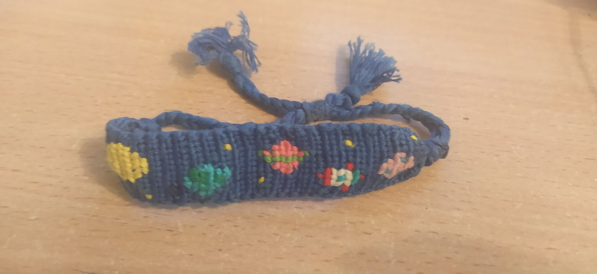
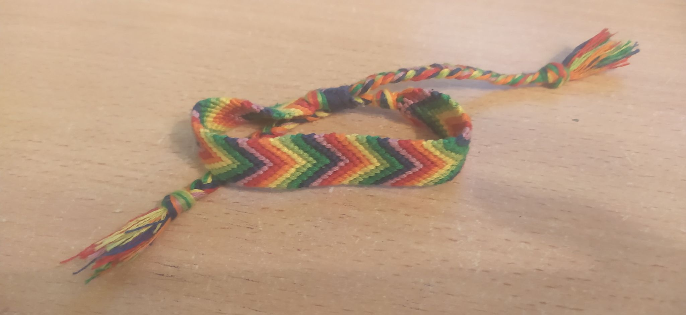
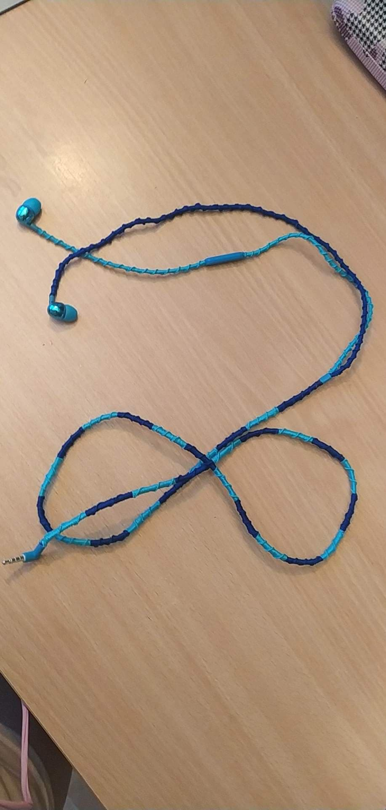

<!DOCTYPE HTML>
<html lang = "pl">

<head>
<meta charset = "utf-8"/>
<meta name= "description " content="Pokaże co można robić z muliny oraz jedno nieptypowe jej zastosowanie przeze mnie"/>
<meta name="keywords" content="mulina, hobby, materiał"/>
<meta http-equiv="X-UA-Compatible" content="IE+edge,chrome=1"/>

</head>

<body>

 
<h2>Plecenie z muliny to łatwa rzecz ale trzeba miec wyczucie i dużo <strong>cierpliwości</strong>. Z tego materiału możne na przykład pleśc bransoletki.</h2>
 

  

  
<h2> Ale muline można wykorzystać w zależności od sytuacji jak zabazpieczenia bala od słuchawe, aby się nie zniszczył.</h2>
 

<h2>
Co do bransoletek używam dwóch stron z których robie wzory
</h2>

<a href="https://www.braceletbook.com/">pierwsza</a>

  

<a href="https://friendship-bracelets.net/">druga</a>

</body>
</html>
